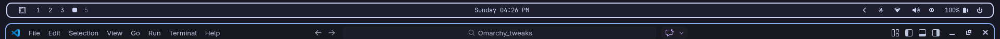
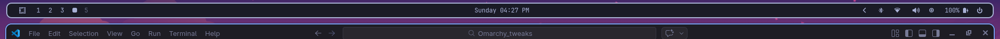

# Waybar Tweaks

Custom Waybar configurations with floating bar design and rounded corners. These themes enhance the default Waybar appearance with modern styling that matches their respective color schemes.

## Features

- **Floating bar design** - Creates visual separation from the screen edges
- **Rounded corners** - Smooth, modern aesthetic for each theme
- **Theme-matched styling** - Colors and borders match the applied theme

## Available Themes

### Eternal Theme


### Catppuccin Theme


### Everforest Theme


### Tokyo Night Theme


## Installation

Copy the configuration files to your Waybar directory:

```bash
~/.config/waybar/config.jsonc
~/.config/waybar/styles.css
```